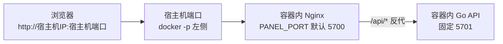

<p align="center">
  
</p>

<h1 align="center">奶龙面板</h1>

<p align="center">
  <em>轻量、现代的定时任务管理面板，Docker 一键部署，开箱即用</em>
</p>

<p align="center">
  
  
  
  
  
</p>

---

奶龙面板是一款轻量级定时任务管理平台，采用 Go (Gin) + Vue3 (Element Plus) + SQLite 架构，专注于脚本托管与自动化任务调度。支持 Python、Node.js（含 `.js` / `.mjs`）、Shell、TypeScript、Go 等多语言脚本的定时执行与可视化管理，内置 18 种消息推送渠道、订阅管理、环境变量、依赖管理、Open API 等功能。Docker 一键部署，开箱即用。

> 最新稳定版：`v1.0.1` · [更新日志](./docs/release-notes/v1.0.1.md)<br>
> 本次重点：新增 `.env.example`，复制为 `.env` 后 Debian 版 Docker 可直接 `docker compose up -d --build`，不必每次加 `-f docker-compose.debian.yml`。<br>
> APP 客户端：[xiaofeilong2/panel-app](https://gitee.com/xiaofeilong2/panel-app)

## 功能特性

- **定时任务** — Cron 表达式调度，支持重试、超时、定时停止、任务依赖、前后置钩子
- **脚本管理** — 在线代码编辑器，支持 Python、Node.js（含 `.mjs`）、Shell、TypeScript、Go，拖拽移动文件
- **执行日志** — SSE 实时日志流，历史日志查看与自动清理
- **环境变量** — 分组管理、拖拽排序、批量导入导出（兼容青龙格式）
- **订阅管理** — 自动从 Git 仓库拉取脚本，支持定期同步
- **依赖管理** — 可视化安装/卸载 Python (pip) 和 Node.js (npm) 依赖
- **通知推送** — Bark、Telegram、Server酱、企业微信、钉钉、飞书等 18 种渠道
- **开放 API** — App Key / App Secret 认证，支持第三方系统对接
- **系统安全** — 双因素认证 (2FA)、IP 白名单、登录日志、多设备会话管理
- **数据备份** — 一键备份与恢复，支持每天/每周/每月定时备份
- **系统监控** — 实时 CPU / 内存 / 磁盘监控，任务执行趋势统计

<details>
<summary><b>展开：逐模块的完整能力清单（订阅的白名单 / 黑名单 / 依赖规则匹配细节在这里）</b></summary>

### 定时任务管理
- 标准 Cron 表达式调度
- 常用时间规则快捷选择
- 任务启用/禁用状态切换
- 手动触发执行
- 任务超时控制与重试机制
- 前后置钩子（任务依赖链）
- 多实例并发控制

### 脚本文件管理
- 在线代码编辑器（语法高亮）
- 支持创建、重命名、删除文件
- 支持文件上传与拖拽移动
- 脚本版本管理
- 调试运行与实时日志输出
- 支持 `.mjs` 脚本调试与任务执行

### 执行日志
- SSE 实时日志流
- 执行状态追踪（成功/失败/超时/手动终止）
- 执行耗时统计
- 日志自动清理策略

### 环境变量
- 安全存储敏感配置
- 变量值脱敏显示
- 分组管理与拖拽排序
- 批量导入导出（兼容青龙格式）
- 任务执行时自动注入

### 订阅管理
- Git 仓库自动拉取
- 定期同步（Cron 调度）
- SSH Key / Token 认证
- 白名单/黑名单/依赖规则过滤（对应青龙 `ql repo` 的第 2/3/4 个参数，`,` 与 `|` 均可作分隔符，匹配方式是「子串包含」而非正则）
  - 白名单不仅筛选任务，还会参与实际检出范围：只有命中白名单的文件会落盘并建成定时任务。
  - 依赖规则同样参与检出：命中的文件会被拉取到脚本目录供主脚本调用，但**不会**建成定时任务，主脚本 require 的辅助库填这里即可，不必再塞进白名单。
  - 黑名单对两者都生效；白名单留空时视为全部命中，依赖规则不改变任何行为。

### 消息推送
- 18 种主流推送渠道
- 任务执行结果通知
- 系统事件告警
- 自定义推送模板

### 系统设置
- 双因素认证 (2FA / TOTP)
- IP 白名单
- 登录日志与多设备会话管理（可配置网页端 / APP 端最大会话数）
- 数据备份与恢复（含视图数据）
- 定时备份（每天 / 每周 / 每月）
- 面板标题与图标自定义

</details>

## 效果图

<details>
<summary><b>展开：12 张界面截图（仪表盘 / 定时任务 / 执行日志 / 脚本 / 订阅 / 系统设置…）</b></summary>

| 功能 | 截图 |
|------|------|
| 仪表盘 |  |
| 定时任务 |  |
| 执行日志 |  |
| 用户管理 |  |
| 脚本管理 |  |
| 环境变量 |  |
| 订阅管理 |  |
| 通知渠道 |  |
| Open API |  |
| 依赖管理 |  |
| 系统设置 |  |
| 个人设置 |  |

</details>

## 快速部署

面板官方推荐用 Docker 部署。下面的例子默认浏览器访问 `http://宿主机IP:5700`。

### 一键启动（Alpine 运行时）

```yaml
# docker-compose.yml
name: panel

services:
  panel:
    image: ${PANEL_IMAGE:-xiaofeilong2/panel:latest}
    container_name: panel
    restart: unless-stopped
    ports:
      - "5700:5700"                                # 宿主机端口:容器内 Nginx 端口
    volumes:
      - ./Panel:/app/Panel               # 面板数据目录，升级保留
    environment:
      - TZ=Asia/Shanghai
      - CONTAINER_NAME=panel
      - IMAGE_NAME=${PANEL_IMAGE:-xiaofeilong2/panel:latest}
      - PANEL_UPDATE_MANAGER=watchtower
      - WATCHTOWER_HTTP_API_URL=${WATCHTOWER_HTTP_API_URL:-http://watchtower:8080}
      - WATCHTOWER_HTTP_API_TOKEN=${WATCHTOWER_HTTP_API_TOKEN:-panel-watchtower-token}
      - WATCHTOWER_HTTP_API_PERIODIC_POLLS=true
    labels:
      - com.centurylinklabs.watchtower.enable=true

  watchtower:
    image: nickfedor/watchtower:latest
    container_name: panel-watchtower
    restart: unless-stopped
    volumes:
      - /var/run/docker.sock:/var/run/docker.sock
    labels:
      - com.centurylinklabs.watchtower.enable=false
    environment:
      - WATCHTOWER_HTTP_API_TOKEN=${WATCHTOWER_HTTP_API_TOKEN:-panel-watchtower-token}
      - WATCHTOWER_HTTP_API_PERIODIC_POLLS=true
      - WATCHTOWER_HTTP_API_ENDPOINTS=update
    command:
      - --label-enable
      - --cleanup
      - --interval
      - "3600"
```

```bash
docker compose up -d
```

首次访问 `http://localhost:5700` 会进入管理员初始化。

<details>
<summary><b>展开：这份 compose 每一条在做什么 · Docker Hub 太慢怎么换镜像源 · 不想自动更新怎么删掉 Watchtower · docker run 等价写法</b></summary>

如果 Docker Hub 访问慢，可以设置一次 `PANEL_IMAGE`，让 `image` 和 `IMAGE_NAME` 同时使用你信任的镜像加速地址；README 默认不再内置固定第三方镜像源。也可以到 [容器镜像监控](https://status.anye.xyz/) 查看更多 Docker Hub 镜像加速源状态，再选择可用地址填写。

这份 compose 已经是推荐的可直接上线版本：

1. 面板容器只挂业务数据目录 `./Panel:/app/Panel`
2. `docker.sock` 只暴露给 Watchtower，不暴露给面板容器
3. `PANEL_IMAGE` 同时控制容器实际镜像和面板记录的 `IMAGE_NAME`，切换标签只改一处
4. 只有打了 `com.centurylinklabs.watchtower.enable=true` 标签的容器会被自动更新
5. Watchtower 自己显式打了 `com.centurylinklabs.watchtower.enable=false`，避免被这套规则误纳入管理
6. `WATCHTOWER_HTTP_API_ENDPOINTS=update` 开放面板所需的更新入口；API 只在 Compose 内部网络使用，没有向宿主机开放端口
7. `WATCHTOWER_HTTP_API_PERIODIC_POLLS=true` 保留定时轮询，`--interval 3600` 表示每 1 小时检查一次更新
8. `--cleanup` 会在更新后清理旧镜像；当前使用 `nickfedor/watchtower:latest` 兼容新版 Docker API

如果你不想自动更新，可以删除 `watchtower` 服务、`labels`、`PANEL_UPDATE_MANAGER=watchtower` 和 `WATCHTOWER_HTTP_API_*`，然后改成在宿主机手动执行：

```bash
docker compose pull
docker compose up -d
```

想用 `docker run` 而不是 compose，推荐等价方式是分别启动面板容器和 Watchtower 容器：

```bash
docker network create panel-net
WATCHTOWER_API_TOKEN=panel-watchtower-token

docker run -d --pull=always \
  --name panel \
  --network panel-net \
  --restart unless-stopped \
  -p 5700:5700 \
  -v "$(pwd)/Panel:/app/Panel" \
  -e TZ=Asia/Shanghai \
  -e CONTAINER_NAME=panel \
  -e IMAGE_NAME=xiaofeilong2/panel:latest \
  -e PANEL_UPDATE_MANAGER=watchtower \
  -e WATCHTOWER_HTTP_API_URL=http://panel-watchtower:8080 \
  -e WATCHTOWER_HTTP_API_TOKEN="$WATCHTOWER_API_TOKEN" \
  -e WATCHTOWER_HTTP_API_PERIODIC_POLLS=true \
  --label com.centurylinklabs.watchtower.enable=true \
  xiaofeilong2/panel:latest

docker run -d \
  --name panel-watchtower \
  --network panel-net \
  --restart unless-stopped \
  -v /var/run/docker.sock:/var/run/docker.sock \
  -e WATCHTOWER_HTTP_API_TOKEN="$WATCHTOWER_API_TOKEN" \
  -e WATCHTOWER_HTTP_API_PERIODIC_POLLS=true \
  -e WATCHTOWER_HTTP_API_ENDPOINTS=update \
  --label com.centurylinklabs.watchtower.enable=false \
  nickfedor/watchtower:latest \
  --label-enable \
  --cleanup \
  --interval 3600
```

</details>

<details>
<summary><b>展开：该选哪个镜像标签 —— 要跑 Go 任务 / 装需要现场编译的依赖 / 换 Debian 运行时 / 指定 Python 3.10、3.11 / 查 CPU 架构支持 / 本地源码构建</b></summary>

### 支持的 CPU 架构

镜像是 multi-arch manifest list，`docker pull` 时按你机器自动选对应平台：

| 架构 | 典型机器 |
|------|---------|
| `linux/amd64` | x86_64 服务器、PC、绝大多数 NAS |
| `linux/arm64` | 树莓派 4 / 5、Oracle ARM 云、Apple Silicon |
| `linux/386` | 32 位 x86 老 PC、瘦客户端（仅 `latest` / `latest-full`，Debian 镜像不支持） |
| `linux/arm/v7` | **v2.0.9 新增**：树莓派 2 / 3 / Zero 2W、老 ARMv7 盒子 / 路由器 / NAS |

### Alpine 与 Debian 运行时和镜像标签

镜像分成两个基础系统和两个工具档位。Alpine 使用 `apk`，体积更小；Debian 使用 `apt` 和 glibc，适合依赖 Debian/Ubuntu 软件包的脚本。

| 工具档位 | 默认包含 | 额外工具或限制 |
|----------|----------|----------------|
| 精简版 | 目标 Python 与 pip/venv、Node.js/npm、`apk` 或 `apt`、Git/SSH、bash、curl、Nginx 和基础运行库 | 不含 Go、Docker CLI、wget、C/C++ 编译链、make、Linux 头文件和 pkg-config |
| 完整版 | 精简版的全部内容 | 额外包含 Go/gofmt、Docker CLI、wget、C/C++ 编译链、make、Linux 头文件和 pkg-config |

自 `v3.0.0` 起，**Go 任务必须使用 `latest-full` 或 `debian-full`。** 安装需要现场编译原生扩展的 pip/npm 依赖时，也建议使用完整版。普通 Python、JavaScript、TypeScript 和 Shell 任务优先使用体积更小的精简版。

自 `v3.0.0` 起提供下面 10 个正式浮动标签，其中包含 `debian-full`。在 Watchtower 或 Compose 部署中，浮动标签会持续收到新版，固定版本标签用于锁定环境。

| 正式浮动标签 | 固定版本标签示例 | 基础系统 | Python | 工具档位 | 支持平台 |
|--------------|------------------|----------|--------|----------|----------|
| `latest` | `3.0.7` | Alpine | 3.12 | 精简 | amd64 / arm64 / 386 / arm/v7 |
| `latest-full` | `3.0.7-full` | Alpine | 3.12 | 完整 | amd64 / arm64 / 386 / arm/v7 |
| `latest-3.10` | `3.0.7-3.10` | Alpine | 3.10 | 精简 | amd64 / arm64 |
| `latest-3.11` | `3.0.7-3.11` | Alpine | 3.11 | 精简 | amd64 / arm64 |
| `latest-all` | `3.0.7-all` | Alpine | 3.10 / 3.11 / 3.12 | 精简 | amd64 / arm64 |
| `debian` | `3.0.7-debian` | Debian | 3.12 | 精简 | amd64 / arm64 / arm/v7 |
| `debian-full` | `3.0.7-debian-full` | Debian | 3.12 | 完整 | amd64 / arm64 / arm/v7 |
| `debian-3.10` | `3.0.7-debian-3.10` | Debian | 3.10 | 精简 | amd64 / arm64 / arm/v7 |
| `debian-3.11` | `3.0.7-debian-3.11` | Debian | 3.11 | 精简 | amd64 / arm64 / arm/v7 |
| `debian-all` | `3.0.7-debian-all` | Debian | 3.10 / 3.11 / 3.12 | 精简 | amd64 / arm64 / arm/v7 |

后续版本只替换固定版本标签里的版本号，后缀保持不变。

#### Python 去重与 32 位例外

- Alpine 的 `amd64 / arm64` 和全部 Debian 镜像不再同时安装系统 Python，只保留 `/opt/panel-python` 下的目标独立运行时。
- `latest-all` 和 `debian-all` 只包含 Python 3.10、3.11、3.12 三套独立运行时，不会再多装一套系统 Python。
- Alpine 的 `linux/386` 与 `linux/arm/v7` 没有对应的独立 Python 资产，因此 `latest`、`latest-full` 在这两个平台只使用 Alpine 系统 Python 3.12。这是 32 位平台的兼容例外，仍然只有一套 Python。
- `latest-3.10`、`latest-3.11`、`latest-all` 只发布 `amd64 / arm64`，不会发布“标签写 3.10，实际却是 3.12”的 32 位镜像。

#### 新标签与旧别名迁移

自 `v3.0.0` 起，新的连字符标签是正式名称。下面 6 个旧浮动标签仍由同一次构建推送，现有 Watchtower 部署不会因为改名而断更：

| 旧兼容别名 | 新正式标签 |
|------------|------------|
| `latest3.10` | `latest-3.10` |
| `latest3.11` | `latest-3.11` |
| `latestall` | `latest-all` |
| `debian3.10` | `debian-3.10` |
| `debian3.11` | `debian-3.11` |
| `debianall` | `debian-all` |

Debian 的旧固定版本格式也保留兼容别名：`3.0.7-debian3.10`、`3.0.7-debian3.11`、`3.0.7-debianall` 分别对应新的 `3.0.7-debian-3.10`、`3.0.7-debian-3.11`、`3.0.7-debian-all`。新部署请直接使用新名称。

#### 切换标签与本地构建

改过前端/后端源码后，在项目根目录本地构建镜像（`VERSION=dev` 避免面板显示过期默认版本号）：

```bash
# Alpine 运行时（默认 Python 3.12 精简版）
docker build --build-arg VERSION=dev -t panel:local .

# Debian 运行时
docker build --build-arg VERSION=dev -f Dockerfile.debian -t panel:debian-local .
```

构建完成后可指定本地镜像启动 Compose：

```bash
PANEL_IMAGE=panel:local docker compose up -d
PANEL_IMAGE=panel:debian-local docker compose -f docker-compose.debian.yml up -d
```

仓库里的两份基础 Compose 都只需要设置一次镜像变量。例如切换到 Alpine 完整版：

```bash
PANEL_IMAGE=xiaofeilong2/panel:latest-full docker compose up -d
```

也可以在 `.env` 中设置 `PANEL_IMAGE=xiaofeilong2/panel:latest-full` 后再运行 `docker compose up -d`。Compose 会把同一个值同时写入 `image` 和 `IMAGE_NAME`，不会出现容器运行标签和更新标签不一致。

切到 Debian 运行时：

```bash
docker compose -f docker-compose.debian.yml up -d
```

若你**总是**用 Debian 版，可复制 `.env.example` 为 `.env` 并保留其中的 `COMPOSE_FILE=docker-compose.debian.yml`。之后在同一目录直接执行 `docker compose up -d --build` 即可，Compose 会自动读 `.env`，不必每次加 `-f`。

本地构建时，`PYTHON_RUNTIME_MODE` 决定单版本或三版本，`PYTHON_RUNTIME_VERSION` 决定单版本镜像的 Python 版本，`INSTALL_FULL_TOOLS=true` 决定是否安装完整开发工具。下面的命令可以直接运行：

```bash
# Alpine：单版本 Python 3.10 精简版；改成 3.11 或 3.12 可构建对应单版本
docker build \
  --build-arg VERSION=dev \
  --build-arg PYTHON_RUNTIME_MODE=single \
  --build-arg PYTHON_RUNTIME_VERSION=3.10 \
  --build-arg INSTALL_FULL_TOOLS=false \
  -t panel:latest-3.10-local .

# Alpine：默认 Python 3.12 完整版
docker build \
  --build-arg VERSION=dev \
  --build-arg PYTHON_RUNTIME_MODE=single \
  --build-arg PYTHON_RUNTIME_VERSION=3.12 \
  --build-arg INSTALL_FULL_TOOLS=true \
  -t panel:latest-full-local .

# Alpine：Python 3.10 / 3.11 / 3.12 三版本精简版
docker build \
  --build-arg VERSION=dev \
  --build-arg PYTHON_RUNTIME_MODE=all \
  --build-arg PYTHON_RUNTIME_VERSION=3.12 \
  --build-arg INSTALL_FULL_TOOLS=false \
  -t panel:latest-all-local .

# Debian：单版本 Python 3.11 精简版
docker build -f Dockerfile.debian \
  --build-arg VERSION=dev \
  --build-arg PYTHON_RUNTIME_MODE=single \
  --build-arg PYTHON_RUNTIME_VERSION=3.11 \
  --build-arg INSTALL_FULL_TOOLS=false \
  -t panel:debian-3.11-local .

# Debian：默认 Python 3.12 完整版
docker build -f Dockerfile.debian \
  --build-arg VERSION=dev \
  --build-arg PYTHON_RUNTIME_MODE=single \
  --build-arg PYTHON_RUNTIME_VERSION=3.12 \
  --build-arg INSTALL_FULL_TOOLS=true \
  -t panel:debian-full-local .

# Debian：Python 3.10 / 3.11 / 3.12 三版本精简版
docker build -f Dockerfile.debian \
  --build-arg VERSION=dev \
  --build-arg PYTHON_RUNTIME_MODE=all \
  --build-arg PYTHON_RUNTIME_VERSION=3.12 \
  --build-arg INSTALL_FULL_TOOLS=false \
  -t panel:debian-all-local .
```

</details>

<details>
<summary><b>展开：Windows 单机版 —— 不装 Docker，下载 zip 解压双击 start.bat 就能跑</b></summary>

### Windows 单机版（不走 Docker）

Windows 用户可以直接下载编译好的 zip 解压运行，面板内置 Go 后端同时托管前端（无需 Nginx / Docker）。

1. 去 [GitHub Release](https://gitee.com/xiaofeilong2/panel/releases) 下载 `panel-windows-amd64.zip` 解压到任意目录（建议路径无空格、无中文，例如 `D:\panel`）。
2. 双击 `start.bat` 启动服务。
3. 浏览器访问 `http://localhost:5700`，首次进入创建管理员账号。

> 注意：仓库源码目录中的本地 `server/*.exe` 仅用于开发阶段临时调试，不作为可信发布产物。  
> Windows 正式发布包请始终以 GitHub Release 中 workflow 构建出的 `panel-windows-amd64.zip` 为准。

解压后目录：

```
panel-windows-amd64/
├── panel-server.exe     # 后端主程序（同端口同时服务前端）
├── ddp.exe               # 运维 CLI
├── web/                  # 前端静态资源（Go 通过 web_dir 直接托管）
├── config.yaml           # 端口 / 数据目录配置
├── start.bat             # 启动脚本（chcp 65001 兜底中文显示）
├── README.txt            # 详细使用说明
└── Panel/           # 首次启动时自动创建，含数据库 / 脚本 / 日志 / 备份
```

**可选：脚本执行环境**。如需面板调度 Python / Node.js 脚本，请自行安装 Python 3.10+ 和 Node.js 20 LTS 并勾选 "Add to PATH"，重启 `start.bat` 即可（`ddp.exe`、脚本执行器会从 PATH 找到对应的 `python` / `node`）。

**Python 多版本说明**：二进制部署包不会内置 Python 3.10 / 3.11 / 3.12 三个解释器，用户只需要安装实际要使用的版本。面板会为已检测到的 Python 版本创建独立依赖环境；未安装的版本会在依赖管理里提示不可用，不影响其他版本的脚本运行。Windows 建议安装官方 Python 并保留 `py` 启动器，Linux 需要确保 `python3.10` / `python3.11` / `python3.12` 能在 PATH 中被找到。

**升级**：优先在面板后台进入「系统设置」→「概览」→「检查系统更新」→「立即更新」。二进制后台更新会自动下载对应平台的 Release 包，替换程序与前端文件，并保留现有 `config.yaml`、`Panel\`、`data\`、`logs\`、`backups\` 等本地配置和数据目录。只有在程序目录没有写入权限、网络无法访问 GitHub Release，或后台更新失败时，才需要手动下载新版 zip 后迁移数据。

</details>

<details>
<summary><b>展开：Android Magisk 模块 —— 已 Root 的手机上直接跑，不需要 Docker、不需要 Termux</b></summary>

### Android Magisk 模块（Root 手机）

在已 Root 的 Android 设备上直接跑面板，无需 Docker、无需 Termux。模块会在安装阶段下载一份 rootfs 到 `/data/panel`，在容器里装好 Python / Node.js / Git 等运行时，然后通过 `rurima` 进入容器启动后端，开机自启。

- **支持**：Magisk v24.0+ / KernelSU / APatch；Android 6.0+（建议 8.0+）；**仅 `arm64`**（容器运行时只有 aarch64 构建，x86_64 设备安装时会被明确拦截）
- **默认访问**：`http://127.0.0.1:5700`，后端绑定 `0.0.0.0`，局域网 / 内网穿透可直连
- **一键更新**：自 `v3.0.3` 起可在面板里在线升级（只换面板程序与前端，容器与已装依赖不动，不用重启手机）。在线升级**覆盖不到模块脚本**，所以由模块脚本实现的新能力（例如 `v3.0.4` 的「停止面板服务」）需要重刷一次 ZIP 才有；模块 `updateJson` 会推送新版 ZIP 并保留数据
- **手动停止 / 启动**：自 `v3.0.4` 起，点模块卡片的「运行 / Action」按钮即可停止面板（再点一次启动），停止状态跨重启保持；也可以在面板「设置 → 概览 → 停止面板服务」里操作
- **下载**：[GitHub Release](https://gitee.com/xiaofeilong2/panel/releases)

两个可选版本，**装哪个都行，但只能装一个**：

| ZIP | 容器 | 什么时候选 |
|-----|------|-----------|
| `panel-magisk-vX.Y.Z.zip` | Alpine 3.18（musl） | **默认选它**。体积小、装得快，磁盘 ≥1.5 GB |
| `panel-magisk-debian-vX.Y.Z.zip` | Debian 12（glibc） | 需要跑 glibc 预编译产物时。最典型的是面板「依赖管理」里的**一键安装 Python / Node 运行时**——它下发的是 `*-unknown-linux-gnu` 与 nodejs.org 官方构建，**在 Alpine(musl) 容器里根本无法执行**（实测 0/2）。磁盘 ≥2.5 GB |

> 自 `v3.0.3` 起两个 flavor 各有各的 `updateJson`，Debian 版在管理器里点「更新」不会再被静默换成 Alpine 版。从 `v3.0.2` 或更早升上来的 Debian 用户需要先手动刷一次 v3.0.3 的 Debian ZIP，之后管理器才会走对地址。Debian 版**仍未经过真机验证**。详见 `Magisk/README.md`。

> 📱 **完整的安装 / 升级 / 卸载 / 端口配置 / 排障文档请看 → [`Magisk/README.md`](./Magisk/README.md)**

</details>

## 文档导航

上面就是最小可用的部署路径。剩下的内容默认收起，按需展开：

| 我想… | 看哪里 |
|-------|--------|
| 跑 Go 任务、装需要现场编译的依赖、换 Debian 运行时、指定 Python 3.10 / 3.11 | [快速部署](#快速部署) → 「该选哪个镜像标签」 |
| 不用 Docker，在 Windows 上直接跑 | [快速部署](#快速部署) → 「Windows 单机版」 |
| 在已 Root 的安卓手机上跑 | [快速部署](#快速部署) → 「Android Magisk 模块」，完整文档见 [`Magisk/README.md`](./Magisk/README.md) |
| 改端口、配 Nginx / 宝塔 / Caddy 反代、SSE 日志流断掉 | [端口与反向代理](#端口与反向代理) |
| 升级到新版本 | [更新](#更新) |
| 忘了密码 / 用户名，或 IP 白名单把自己锁在门外 | [容器命令 `ddp`](#容器命令-ddp) |
| 在定时任务脚本里回头调面板：发通知、写回环境变量、触发别的任务 | [脚本内调用面板能力](./docs/script-api.md) |
| 备份、迁移、想知道数据存在哪 | [数据目录](#数据目录) |
| 查 Docker 环境变量、`config.yaml` 怎么配 | [配置参考](#配置参考) |
| 看这一版改了什么 | [v3.0.7 更新日志](./docs/release-notes/v3.0.7.md) |

## 端口与反向代理

<details>
<summary><b>展开：3 个端口分别归谁管 · 只改宿主机端口怎么写 · Magisk 模块改端口 · Nginx 反代模板（SSE 必须关 proxy_buffering）</b></summary>

### 端口三兄弟

面板在容器内有 **3 个端口**，搞清它们，大多数部署问题都会消失：

| 端口 | 由谁决定 | 默认 | 要不要改 |
|------|---------|------|----------|
| **宿主机端口** | docker `-p` 左侧 | `5700` | 常改 |
| **容器内 Nginx 端口** | 环境变量 `PANEL_PORT`，`-p` 右侧应与其一致 | `5700` | 基本不改 |
| **容器内 Go 后端端口** | 环境变量 `SERVER_PORT` | `5701` | **不要改** |



两条经验记住就够用：

1. **Docker 部署通常只改 `-p` 左侧**，右侧保持 `5700` 即可。
2. **宿主机 Nginx / 宝塔 / Caddy 反代的目标是宿主机端口**（比如 `127.0.0.1:5700`），**别直接代理到容器内 `5701`**——SSE 会断流、鉴权会丢。

### 想改端口

**只改宿主机端口**（最常见，比如让浏览器走 8080）：

```yaml
ports:
  - "8080:5700"
```

**连容器内 Nginx 端口一起改**（只在容器内 5700 和其他服务冲突时）：`-p` 右侧必须和 `PANEL_PORT` 一致，Go 后端 `5701` 不受影响。

```bash
docker run -d --name panel \
  -p 8080:7100 \
  -e PANEL_PORT=7100 \
  ...
```

### Magisk 模块（Android Root）改端口

Magisk 模块版和 Docker 结构不一样：没有容器内 Nginx，前端 / 后端都由单个 `panel-server` 二进制在 `PANEL_PORT` 上直接托管，**不要**直接去改 `config.yaml`——每次开机 `service.sh` 都会按 `ports.conf` 重新生成 `config.yaml`，手动改的内容会被覆盖。

改端口的唯一入口是编辑持久化目录下的 `ports.conf`：

```bash
su
vi /data/adb/panel/ports.conf
```

> 首次安装模块时会自动生成这个文件，内容带注释，直接修改对应的值即可。

里面有三个可选变量：

| 变量 | 作用 | 默认 |
|------|------|------|
| `PANEL_PORT` | 浏览器访问面板的端口（绑定 `0.0.0.0`，本机 / 局域网 / 内网穿透都能连） | `5700` |
| `SSH_PORT` | 容器内 SSH 端口（adb / Termux 登入容器调试用） | `22` |
| `EXTRA_CORS_ORIGINS` | 额外 CORS 白名单，英文逗号分隔。仅在跨域场景需要（如内网穿透公网端口与面板端口不同，或自定义域名访问） | 空 |

示例：

```ini
PANEL_PORT=6700
SSH_PORT=2222
EXTRA_CORS_ORIGINS="https://panel.example.com,https://xx.trycloudflare.com"
```

改完后重启手机，或手动执行以下命令让配置立即生效：

```bash
su -c "sh /data/adb/modules/panel/service.sh"
```

生效后在 Magisk / KernelSU / APatch 管理器里点模块卡片的「运行」按钮，可以看到当前 `PANEL_PORT` / `SSH_PORT` 的实际监听状态。完整的 Magisk 模块安装 / 升级 / 卸载文档见 [`Magisk/README.md`](./Magisk/README.md)。

### 反向代理示例

最常见是 **宿主机 Nginx → Docker 已发布端口**。面板暴露在宿主机 `5700`，反代就指向那里：

#### 宿主机 Nginx 示例（HTTPS，含 SSE 支持）

```nginx
map $http_upgrade $connection_upgrade {
    default upgrade;
    '' close;
}

server {
    listen 443 ssl http2;
    server_name your-domain.com;

    ssl_certificate     /path/to/fullchain.pem;
    ssl_certificate_key /path/to/privkey.pem;

    location / {
        proxy_pass http://127.0.0.1:5700;   # 宿主机端口，不是容器内 5701

        proxy_set_header Host $host;
        proxy_set_header X-Real-IP $remote_addr;
        proxy_set_header X-Forwarded-For $proxy_add_x_forwarded_for;
        proxy_set_header X-Forwarded-Proto https;

        proxy_http_version 1.1;
        proxy_set_header Upgrade $http_upgrade;
        proxy_set_header Connection $connection_upgrade;

        proxy_buffering off;                 # SSE 日志流必须关
        proxy_read_timeout 300s;
    }
}
```

如果反代本身也跑在同一 Docker 网络里，可以直接代理到 `http://panel:5700`（依然是容器内 Nginx 端口）。

**别做的事**：

- 让浏览器或反代绕过容器内 Nginx 直接访问 Go 后端 `5701`
- 把 SSE / 下载 / 鉴权接口单独绕出去
- 让 `-p` 右侧容器端口和 `PANEL_PORT` 不一致

</details>

## 更新

<details>
<summary><b>展开：面板内一键更新分别走哪条链路（Watchtower / Docker CLI / 二进制 / Magisk 模块）· Compose 手动 pull 重建怎么写</b></summary>

### 面板内一键更新（推荐）

进入「系统设置」→「概览」→ 点「检查系统更新」。系统会自动识别当前部署方式：

- **Docker 精简版**：自 `v3.0.0` 起，统一由 Watchtower 拉取并重建容器。仓库自带的两份基础 Compose 已配置内部 HTTP API，所以页面手动更新和面板的 `auto_update` 都能触发 Watchtower；Watchtower API 没有向宿主机开放端口。
- **Docker 完整版**：同样推荐使用 Watchtower。早期直接把 `/var/run/docker.sock` 挂给面板、由面板调用 Docker CLI 更新的部署仍可保留原有 Socket 挂载，但这条兼容更新链只支持完整版标签。使用 `3.0.7-full`、`3.0.7-debian-full` 这类固定完整版标签触发一键更新时，面板会切换到同系列浮动标签 `latest-full` 或 `debian-full`；精简版不包含 Docker CLI。
- **二进制部署**：自动匹配 `panel-windows-amd64.zip` 或 `panel-linux-*.tar.gz`，后台下载、解压、替换程序和 `web/` 前端文件，更新过程会跳过 `config.yaml` 与数据目录，避免覆盖服务器本地配置。
- **Magisk 模块版**（自 `v3.0.3`）：下载对应架构的 `panel-linux-*.tar.gz`，只替换容器内的 `panel-server`、`ddp` 和前端目录，同时写回模块目录并同步 `module.prop` 版本号，保证重启后不回滚。容器 rootfs、apt/apk 系统包、Python venv 与已装依赖、`config.yaml`、`ports.conf` 一概不动，**不需要重启手机**。
  ⚠️ 在线升级**替换不了模块脚本**（`service.sh` / `customize.sh` / `action.sh`），升完之后是「新面板 + 旧模块外壳」，管理器里的版本号会跟着变成新版。所以由模块脚本实现的新能力需要重刷一次 ZIP 才有 —— 例如 `v3.0.4` 的「停止面板服务」，在线升级上来的用户在面板里会看到该按钮被禁用并提示当前外壳版本。只有当新面板**根本无法**在旧外壳上运行时，面板才会在检查更新阶段直接拒绝升级并要求重刷 ZIP。

### 手动更新

先在项目目录的 `.env` 中持久写入实际使用的镜像。例如 Alpine 默认镜像写入：

```dotenv
PANEL_IMAGE=xiaofeilong2/panel:latest
```

然后只拉取并重建面板服务，`image` 与容器内 `IMAGE_NAME` 会继续使用同一个值：

```bash
# Alpine Compose
docker compose pull panel
docker compose up -d panel

# Debian Compose
docker compose -f docker-compose.debian.yml pull panel
docker compose -f docker-compose.debian.yml up -d panel
```

也可以把 `.env` 中的 `PANEL_IMAGE` 改成对应正式标签，例如 `latest-full`、`latest-3.10`、`latest-3.11`、`latest-all`、`debian-full`、`debian-3.10`、`debian-3.11` 或 `debian-all`。

本地基于源码自己构建的镜像，重新 build 即可（见上文「切换标签与本地构建」）：

```bash
docker build --build-arg VERSION=dev -t panel:local .
docker build --build-arg VERSION=dev -f Dockerfile.debian -t panel:debian-local .
```

</details>

## 容器命令 `ddp`

<details>
<summary><b>展开：忘了密码 / 用户名、IP 白名单把自己锁在门外、备份与恢复、脚本 / 变量 / 任务 / 订阅的命令行操作</b></summary>

容器里预置了 `ddp` CLI，覆盖运维、脚本 / 变量 / 任务 / 订阅管理、账号恢复等场景。统一入口：

```bash
docker exec -it panel ddp <subcommand>
```

> 没叫 `dd` 是因为会和 Linux 自带 `dd` 命令冲突。

### 状态与自检

```bash
ddp help                 # 查看所有子命令
ddp status               # 版本、数据目录、端口、任务数、资源占用、服务状态
ddp check                # 检查配置、数据库、运行目录、运行时命令和更新托管方式
ddp logs --lines 200     # 查看 panel.log
```

### 脚本

```bash
ddp script list
ddp script cat demo.py
ddp script fetch https://example.com/test.py --path tools/test.py
```

### 环境变量

```bash
ddp env list
ddp env get JD_COOKIE
ddp env set JD_COOKIE "pt_key=xxx;pt_pin=yyy;" --group 京东
ddp env delete <id>
```

### 任务与订阅

```bash
ddp task list --status running
ddp task logs 12 --lines 80
ddp task run 12                 # 同步执行任务并实时输出
ddp task stop 12                # 终止运行中的任务

ddp sub list
ddp sub logs 3 --lines 100
ddp sub pull 我的订阅            # 立即执行一次订阅拉取
```

### 运维

```bash
ddp restart                     # 重启容器内 panel-server 进程
ddp update                      # 复用面板一键更新链路
ddp clean-logs 7                # 清理 7 天前的任务日志文件
ddp backup create --name nightly
ddp backup list
ddp backup restore <name>
ddp backup delete <name>
```

### 账号恢复（忘了密码 / 用户名）

```bash
ddp list-users                              # 忘了用户名先看这个
ddp reset-password admin NewPass123         # 单用户时可省略用户名
ddp reset-username admin newadmin
ddp disable-2fa admin                       # 传 --all 则全员禁用
ddp reset-login --all                       # 清登录失败次数，解锁被锁账号
ddp ip-whitelist list                       # 查看当前 IP 白名单
ddp ip-whitelist clear                      # IP 白名单填错进不去面板时，清空后恢复所有 IP 可访问
ddp ip-whitelist set 203.0.113.10           # 直接重设白名单，也支持 CIDR / IPv4 通配格式
```

> **忘记密码怎么办**：`docker exec -it panel ddp list-users` 查出用户名，再 `ddp reset-password <用户名> <新密码>`，不需要删数据重装。
> **IP 白名单填错怎么办**：进入容器执行 `docker exec -it panel ddp ip-whitelist clear`，清空后登录页会恢复所有 IP 可访问，再回面板重新添加正确白名单。

命令也支持直接跑完就退出的一次性形态：

```bash
docker run --rm \
  -v $(pwd)/Panel:/app/Panel \
  xiaofeilong2/panel:latest \
  ddp version
```

</details>

## 数据目录

<details>
<summary><b>展开：Panel 目录里都有什么 —— 备份、迁移带走这一个目录就够了</b></summary>

默认挂在 `./Panel`，保留这一个目录 = 保留整个面板状态：

```
Panel/
├── panel.db          # SQLite 数据库
├── .jwt_secret        # 自动生成的 JWT 密钥
├── panel.log          # 面板运行日志
├── deps/              # Python / Node.js 依赖
├── scripts/           # 脚本文件
├── logs/              # 任务执行日志
└── backups/           # 数据备份
```

</details>

## 配置参考

<details>
<summary><b>展开：Docker 环境变量完整清单 · 启动配置与运行期配置的区别（改哪个、重启会不会丢）</b></summary>

面板有两层配置：

- **启动配置**：Docker 环境变量 + `config.yaml`。Docker 部署时由 `entrypoint.sh` 自动生成，一般不需要手动改。
- **运行期配置**：进面板后「系统设置」里改，落到 SQLite 的 `system_configs` 表，重启不丢失。

### Docker 环境变量

| 变量 | 说明 | 默认 |
|------|------|------|
| `TZ` | 时区 | `Asia/Shanghai` |
| `DATA_DIR` | 数据目录 | `/app/Panel` |
| `DB_PATH` | 数据库路径 | `${DATA_DIR}/panel.db` |
| `PANEL_PORT` | 容器内 Nginx 端口 | `5700` |
| `SERVER_PORT` | 容器内 Go 后端端口（**不要改**） | `5701` |
| `CONTAINER_NAME` / `IMAGE_NAME` | 面板内一键更新识别自己用 | 空 |
| `PANEL_UPDATE_MANAGER` | Docker 更新管理方式；精简镜像应设为 `watchtower` | 空 |
| `WATCHTOWER_HTTP_API_URL` | 面板触发 Watchtower 更新的容器内部地址，不需要映射到宿主机 | `http://watchtower:8080`（基础 Compose 的稳定服务名） |
| `WATCHTOWER_HTTP_API_TOKEN` | 面板与 Watchtower 共用的 HTTP API 令牌 | 基础 Compose 提供内部默认值，正式环境建议自定义 |
| `WATCHTOWER_HTTP_API_PERIODIC_POLLS` | 是否保留 Watchtower 定时轮询 | `true`（基础 Compose） |
| `CORS_ORIGINS` | 额外放行的跨域来源，英文逗号分隔。私有 / 局域网 IP 已自动放行，用公网域名或反代域名访问时才需要 | 空 |
| `PUID` / `PGID` | 让容器以宿主机用户身份运行（NAS 常用，SMB/NFS 共享下文件属主才对得上）。不设则以 root 运行，与历史行为一致 | 空 |

**关于 `PUID` / `PGID`（NAS 用户看这里）**

- **两个都要设**：只设 `PGID` 时 `PUID` 会取到 0，等于没降权，容器会打印说明并继续以 root 跑。宿主机执行 `id` 查看自己的真实取值。
- **取值与镜像里已有账号撞车不要紧**：Debian 版镜像基于 `node:20-bookworm-slim`，自带一个 uid/gid 都是 1000 的 `node` 用户，而 `PUID=1000` 恰好是最常见的取值 —— 容器会直接复用那个账号（`v3.0.7` 起；更早的版本在这里会直接起不来）。
- **改完 `PUID` 要重建容器**（`docker compose up -d --force-recreate`）比只 `docker restart` 更保险。
- **已知限制**：降权之后，面板里的「Linux 系统依赖」（`apt-get` / `apk`）装不了 —— 系统包管理器需要 root。面板会给出明确说明而不是报一串 `Permission denied`。**Node.js / Python 依赖不受影响**，降权下照常安装。

`PANEL_IMAGE` 是宿主机上的 Compose 变量，不是容器内变量。两份基础 Compose 都用它同时设置 `image` 和 `IMAGE_NAME`。

</details>

## 技术栈

<details>
<summary><b>展开：前端 / 后端 / 部署分别用了什么</b></summary>

| 层 | 技术 |
|----|------|
| 前端 | Vue 3 + TypeScript + Element Plus + Pinia + Vite + Monaco Editor |
| 后端 | Go 1.25 + Gin + GORM + SQLite（`glebarez/sqlite` 纯 Go port，`CGO_ENABLED=0`） |
| 部署 | Nginx + Go Binary，Docker 多架构镜像：`linux/amd64` / `linux/arm64` / `linux/386` / `linux/arm/v7` |

</details>

## 致谢

<details>
<summary><b>展开：本项目参考与借鉴的开源项目</b></summary>

本项目的开发离不开以下优秀的开源项目：

- **[白虎面板 (Baihu Panel)](https://github.com/engigu/baihu-panel)** — 后端框架架构参考，部分代码基于白虎面板改进
- **[青龙面板 (Qinglong)](https://github.com/whyour/qinglong)** — 功能设计参考，定时任务管理、环境变量、订阅管理等核心功能借鉴自青龙面板
- **[呆呆面板 (Daidai Panel)](https://github.com/linzixuanzz/daidai-panel)** — 功能与体验参考

感谢以上项目作者的贡献！

</details>

## LICENSE

Copyright © 2026, [xiaofeilong2](https://github.com/xiaofeilong2). Released under the [MIT](LICENSE).
